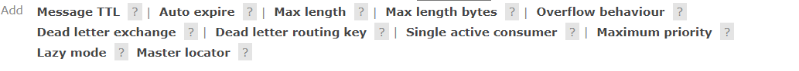

### Rabbitmq工作模型


> 一个交换机可以绑定多个队列，也可以指定多个RoutingKey

### 消息队列核心三要素

消息生产者、消息队列、消息消费者

### 交换机的种类

1. Fanout Exchange（扇形）绑定和发送时不需要指定 RoutingKey
2. Direct Exchange（直连）绑定和发送时需要指定 RoutingKey
3. Topic Exchange（主题）绑定和发送时需要指定 RoutingKey （RoutingKey可以使用通配符 * 表示一个字符 # 表示多个字符）
4. Headers Exchange（头部）

### 消息的过期

1. 针对单条消息设置过期时间
2. 针对整个队列设置过期时间（队列里的所有消息都会有过期时间）

> 如果队列和消息都设置了过期时间，则时间小的为准

### 死信队列


> 消息过期后不是直接消失，而是发送给一个死信交换机（就是普通交换机）从而接收到死信队列（就是普通队列）<br/>
> 使用场景，当用户下单后把订单ID放入队列,(该队列没有消费者)设置队列过期时间为30分钟，30分钟后放入死信队列，<br/>
> 从死信队列拿到订单ID查询数据库，如果用户还未支付修改该订单状态，例如将未支付改为已过期<br/>

变成死信的条件

- 消息过期
- 队列已满，队列头部的消息变成死信
- 消费者手动拒绝或者不确认

### 消息的确认方式

1. 自动确认（默认）
   > 即消费者受到消息立马通知队列删除消息，存在的问题：<br/>
   > 例如这条消息是用来对数据库进行操作，如果数据库操作失败，而队列中的消息也已经删除，就无法进行重试了
2. 手动确认
    - 执行无误 通知队列删除消息
    - 执行异常
        - 消息重新入队
        - 消息进入死信队列

```java
/**
 * 共同点：都可以拒绝消息
 * 不同点：basicNack可以批量拒绝消息，basicReject只能拒绝当前消息
 */
channel.basicNack(deliveryTag,false,false);
        channel.basicReject(deliveryTag,false);
```

### 延迟队列

1. 死信队列实现
   > 注意点：同一队列的消息过期时间一定要一致<br/>
   > 例如：有两条消息，一个过期时间为10 一个为5，为10的在前面，<br/>
   > 由于队列是先进先出的，所以为5的消息就算过期了也还没有进入死信队列
2. 开启延迟插件（需要官网下载）
   > 使用延迟交换机不需要考虑消息过期时间的不一致问题
   ```bash
   rabbitmq-plugins enable rabbitmq_delayed_message_exchange
   ```
   

### 保证消息可靠性

```yaml
spring:
  rabbitmq:
    listener:
      simple:
        acknowledge-mode: manual #设置手动接受消息
    publisher-confirm-type: correlated #开启确认回调
    publisher-returns: true #开启返回回调
```

1. 保证消息到达交换机（ConfirmCallback）
   > 开启发布者确认模式，无论消息是否到达交换机都会触发回调函数，需要手动确认消息是否到达交换机
2. 保证消息到达队列(ReturnsCallback或者使用备用交换机)
   > 只有消息没有到达队列才会触发回调函数
3. 交换机、队列、消息需要持久化
   > 三者默认都是持久化的 消息的所有属性可以通过MessageProperties设置 交换机和队列的属性需要创建时指定
4. 消息的确认需要手动确认
5. 消息的幂等性（避免消息的重复消费）
   > 假设发消息的时候发了两条一模一样的数据（例如一样的订单提交了两次），消费者如果都消费就可能出现问题<br/>
   > 可以使用redis的setnx互斥进行处理
6. 搭建集群

### 交换机的持久化和自动删除

1. 持久化默认开启 即服务器重启后交换机依然存在
2. 自动删除默认关闭，当交换机没有绑定的队列时会自动删除

### 备用交换机（alternate exchange）

> 创建交换机时可以指定备用交换机，当消息从交换机路由到队列失败时，会将消息发给备用交换机（一般定义为扇形）<br/>
> 使用场景：可以使用队列接收这些路由失败的消息进行消费，利用短信服务等通知开发者程序有误

### 队列的属性



- x-overflow 当队列满时的行为 drop-head(默认) 删除头部 reject-publish(不再接收消息)
- x-single-active-consumer 单一消费者 开启后一个队列如果有多个消费者，也只能有一个消费者去消费
